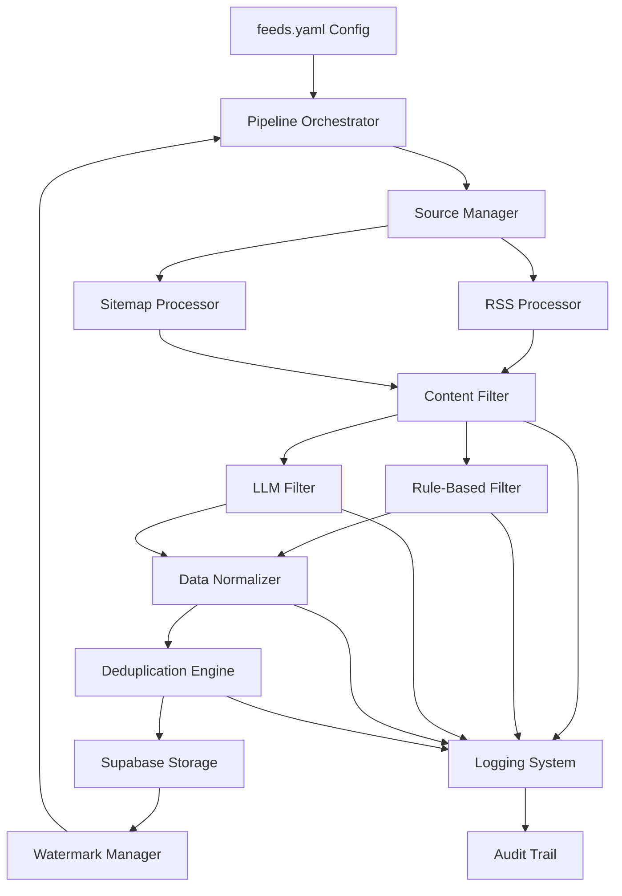

# Design Document: NFL News Processing Pipeline

## Overview

The NFL News Processing Pipeline is a Python-based data ingestion system that extracts URLs and metadata from RSS feeds and sitemaps, filters content for NFL relevance using rule-based and LLM-assisted methods, and stores clean, deduplicated data in Supabase. The system emphasizes incremental processing, transparency, and compliance with publisher terms of service.

### Key Design Principles

- **Metadata-Only Processing**: Extract only URLs, titles, descriptions, and publication dates - never full article content
- **Incremental Ingestion**: Use per-source watermarks to process only new content
- **Intelligent Filtering**: Combine rule-based filtering with LLM assistance for ambiguous cases
- **Transparency**: Log all decisions with scores and rationale for auditability
- **Compliance**: Respect rate limits, terms of service, and ethical data collection practices

## Architecture

### High-Level Architecture



### Component Architecture

The system follows a modular architecture with clear separation of concerns:

1. **Configuration Layer**: Manages feeds.yaml parsing and validation
2. **Orchestration Layer**: Coordinates pipeline execution and error handling
3. **Processing Layer**: Handles RSS/sitemap parsing and content extraction
4. **Filtering Layer**: Applies NFL relevance filtering with rule-based and LLM methods
5. **Storage Layer**: Manages Supabase operations, deduplication, and watermarks
6. **Logging Layer**: Provides comprehensive audit trails and monitoring

## Components and Interfaces

### 1. Configuration Manager

**Purpose**: Parse and validate feeds.yaml configuration

```python
class FeedConfig:
    name: str
    type: str  # 'rss', 'sitemap', 'html'
    url: Optional[str]
    url_template: Optional[str]
    publisher: str
    nfl_only: bool
    enabled: bool
    max_articles: Optional[int]
    days_back: Optional[int]
    extract_content: bool

class ConfigManager:
    def load_config(self, config_path: str) -> Dict[str, Any]
    def validate_config(self, config: Dict) -> bool
    def get_enabled_sources(self) -> List[FeedConfig]
    def get_defaults(self) -> Dict[str, Any]
```

### 2. Source Processors

**RSS Processor**
```python
class RSSProcessor:
    def __init__(self, config: Dict[str, Any])
    def fetch_feed(self, feed_config: FeedConfig) -> List[NewsItem]
    def parse_rss_entry(self, entry: Any) -> NewsItem
    def extract_metadata(self, entry: Any) -> Dict[str, Any]
```

**Sitemap Processor**
```python
class SitemapProcessor:
    def __init__(self, config: Dict[str, Any])
    def fetch_sitemap(self, feed_config: FeedConfig) -> List[NewsItem]
    def construct_sitemap_url(self, url_template: str) -> str
    def parse_sitemap_entry(self, entry: Any) -> NewsItem
    def filter_by_date(self, items: List[NewsItem], days_back: int) -> List[NewsItem]
```

### 3. Content Filter System

**Rule-Based Filter**
```python
class RuleBasedFilter:
    def __init__(self, nfl_keywords: List[str], team_names: List[str])
    def is_nfl_relevant(self, item: NewsItem) -> FilterResult
    def check_url_patterns(self, url: str) -> bool
    def check_title_keywords(self, title: str) -> bool
    def calculate_confidence_score(self, item: NewsItem) -> float

class FilterResult:
    is_relevant: bool
    confidence_score: float
    reasoning: str
    method: str  # 'rule_based' or 'llm'
```

**LLM Filter**
```python
class LLMFilter:
    def __init__(self, model_config: Dict[str, Any])
    def is_nfl_relevant(self, item: NewsItem) -> FilterResult
    def prepare_prompt(self, item: NewsItem) -> str
    def parse_llm_response(self, response: str) -> FilterResult
    def should_use_llm(self, rule_result: FilterResult) -> bool
```

### 4. Data Models

```python
class NewsItem:
    url: str
    title: str
    description: Optional[str]
    publication_date: datetime
    source_name: str
    publisher: str
    raw_metadata: Dict[str, Any]
    
class ProcessedNewsItem(NewsItem):
    relevance_score: float
    filter_method: str
    filter_reasoning: str
    entities: List[str]
    categories: List[str]
    processed_at: datetime

class SourceWatermark:
    source_name: str
    last_processed_date: datetime
    last_successful_run: datetime
    items_processed: int
    errors_count: int
```

### 5. Storage Manager

```python
class StorageManager:
    def __init__(self, supabase_client: Client)
    def store_news_items(self, items: List[ProcessedNewsItem]) -> bool
    def check_duplicate_urls(self, urls: List[str]) -> Set[str]
    def update_watermark(self, source_name: str, timestamp: datetime) -> bool
    def get_watermark(self, source_name: str) -> Optional[datetime]
    def store_audit_log(self, log_entry: AuditLogEntry) -> bool
```

### 6. Pipeline Orchestrator

```python
class NFLNewsPipeline:
    def __init__(self, config_path: str)
    def run_pipeline(self) -> PipelineResult
    def process_source(self, source_config: FeedConfig) -> SourceResult
    def handle_errors(self, error: Exception, context: str) -> None
    def generate_summary_report(self) -> PipelineReport
```

## Data Models

### Database Schema (Supabase)

**news_urls table**
```sql
CREATE TABLE news_urls (
    id UUID PRIMARY KEY DEFAULT gen_random_uuid(),
    url TEXT UNIQUE NOT NULL,
    title TEXT NOT NULL,
    description TEXT,
    publication_date TIMESTAMPTZ NOT NULL,
    source_name TEXT NOT NULL,
    publisher TEXT NOT NULL,
    relevance_score FLOAT NOT NULL,
    filter_method TEXT NOT NULL,
    filter_reasoning TEXT,
    entities JSONB,
    categories TEXT[],
    raw_metadata JSONB,
    created_at TIMESTAMPTZ DEFAULT NOW(),
    updated_at TIMESTAMPTZ DEFAULT NOW()
);

CREATE INDEX idx_news_urls_publication_date ON news_urls(publication_date);
CREATE INDEX idx_news_urls_source_name ON news_urls(source_name);
CREATE INDEX idx_news_urls_relevance_score ON news_urls(relevance_score);
CREATE INDEX idx_news_urls_entities ON news_urls USING GIN(entities);
```

**source_watermarks table**
```sql
CREATE TABLE source_watermarks (
    source_name TEXT PRIMARY KEY,
    last_processed_date TIMESTAMPTZ NOT NULL,
    last_successful_run TIMESTAMPTZ NOT NULL,
    items_processed INTEGER DEFAULT 0,
    errors_count INTEGER DEFAULT 0,
    created_at TIMESTAMPTZ DEFAULT NOW(),
    updated_at TIMESTAMPTZ DEFAULT NOW()
);
```

**pipeline_audit_log table**
```sql
CREATE TABLE pipeline_audit_log (
    id UUID PRIMARY KEY DEFAULT gen_random_uuid(),
    pipeline_run_id UUID NOT NULL,
    source_name TEXT,
    event_type TEXT NOT NULL, -- 'fetch', 'filter', 'store', 'error'
    event_data JSONB,
    message TEXT,
    created_at TIMESTAMPTZ DEFAULT NOW()
);

CREATE INDEX idx_audit_log_pipeline_run ON pipeline_audit_log(pipeline_run_id);
CREATE INDEX idx_audit_log_event_type ON pipeline_audit_log(event_type);
```

## Error Handling

### Error Categories and Strategies

1. **Network Errors**
   - Implement exponential backoff with jitter
   - Retry up to 3 times per source
   - Log detailed error information
   - Continue processing other sources

2. **Parsing Errors**
   - Log malformed feed entries
   - Skip individual problematic items
   - Continue processing remaining items
   - Alert if error rate exceeds threshold

3. **Database Errors**
   - Implement transaction rollback
   - Retry with exponential backoff
   - Preserve watermarks on failure
   - Generate detailed error reports

4. **LLM API Errors**
   - Fallback to rule-based filtering
   - Implement rate limit handling
   - Cache successful responses
   - Log API usage and costs

### Error Recovery Mechanisms

```python
class ErrorHandler:
    def __init__(self, max_retries: int = 3, base_delay: float = 1.0)
    def retry_with_backoff(self, func: Callable, *args, **kwargs) -> Any
    def handle_network_error(self, error: Exception, context: str) -> bool
    def handle_parsing_error(self, error: Exception, item: Any) -> bool
    def handle_database_error(self, error: Exception, operation: str) -> bool
    def should_continue_processing(self, error_count: int, total_items: int) -> bool
```

## Testing Strategy

### Unit Testing

1. **Configuration Testing**
   - Validate feeds.yaml parsing
   - Test configuration validation logic
   - Mock external dependencies

2. **Processor Testing**
   - Mock RSS/sitemap responses
   - Test parsing logic with various feed formats
   - Validate date filtering and URL construction

3. **Filter Testing**
   - Test rule-based filtering with known NFL/non-NFL content
   - Mock LLM responses for consistent testing
   - Validate confidence scoring algorithms

4. **Storage Testing**
   - Mock Supabase operations
   - Test deduplication logic
   - Validate watermark management

### Integration Testing

1. **End-to-End Pipeline Testing**
   - Use test feeds with known content
   - Validate complete pipeline flow
   - Test error handling and recovery

2. **Database Integration Testing**
   - Test with real Supabase instance
   - Validate schema compliance
   - Test concurrent access patterns

### Performance Testing

1. **Load Testing**
   - Test with large feed volumes
   - Validate parallel processing limits
   - Monitor memory usage and performance

2. **Rate Limit Testing**
   - Test compliance with configured limits
   - Validate backoff strategies
   - Test LLM API rate limiting

### Test Data Strategy

```python
# Test fixtures for consistent testing
TEST_RSS_FEEDS = {
    'nfl_only': 'test_data/nfl_rss_feed.xml',
    'mixed_content': 'test_data/mixed_sports_feed.xml',
    'malformed': 'test_data/malformed_feed.xml'
}

TEST_SITEMAPS = {
    'valid_sitemap': 'test_data/valid_sitemap.xml',
    'empty_sitemap': 'test_data/empty_sitemap.xml',
    'large_sitemap': 'test_data/large_sitemap.xml'
}
```

## Performance Considerations

### Optimization Strategies

1. **Parallel Processing**
   - Process multiple sources concurrently
   - Respect max_parallel_fetches configuration
   - Use asyncio for I/O-bound operations

2. **Caching Strategy**
   - Cache LLM responses for identical content
   - Cache parsed feed structures
   - Implement TTL-based cache invalidation

3. **Database Optimization**
   - Use batch inserts for multiple items
   - Implement connection pooling
   - Optimize queries with proper indexing

4. **Memory Management**
   - Process feeds in chunks for large sitemaps
   - Implement streaming for large responses
   - Clear processed data from memory promptly

### Monitoring and Metrics

```python
class PipelineMetrics:
    def __init__(self)
    def record_source_processing_time(self, source: str, duration: float)
    def record_filter_decision(self, method: str, decision: bool, confidence: float)
    def record_database_operation(self, operation: str, duration: float, success: bool)
    def record_llm_usage(self, tokens_used: int, cost: float)
    def generate_performance_report(self) -> Dict[str, Any]
```

## Security Considerations

### Data Protection

1. **API Key Management**
   - Store API keys in environment variables
   - Implement key rotation capabilities
   - Log API usage without exposing keys

2. **Database Security**
   - Use parameterized queries to prevent injection
   - Implement proper access controls
   - Encrypt sensitive data at rest

3. **Network Security**
   - Validate SSL certificates
   - Implement request timeouts
   - Use secure HTTP headers

### Privacy Compliance

1. **Data Minimization**
   - Store only necessary metadata
   - Implement data retention policies
   - Provide data deletion capabilities

2. **Audit Trail**
   - Log all data processing decisions
   - Maintain immutable audit records
   - Implement access logging

## Deployment and Operations

### Configuration Management

```yaml
# deployment/config.yaml
pipeline:
  schedule: "0 */6 * * *"  # Every 6 hours
  max_runtime_minutes: 60
  error_threshold: 0.1  # 10% error rate threshold

monitoring:
  enable_metrics: true
  alert_on_failures: true
  performance_tracking: true

storage:
  batch_size: 100
  connection_pool_size: 10
  query_timeout_seconds: 30
```

### Monitoring and Alerting

1. **Health Checks**
   - Pipeline execution status
   - Database connectivity
   - LLM API availability

2. **Performance Monitoring**
   - Processing time per source
   - Filter accuracy metrics
   - Database operation latency

3. **Error Alerting**
   - Failed pipeline runs
   - High error rates
   - API quota exhaustion

This design provides a robust, scalable, and maintainable foundation for the NFL news processing pipeline while ensuring compliance with ethical data collection practices and providing comprehensive auditability.