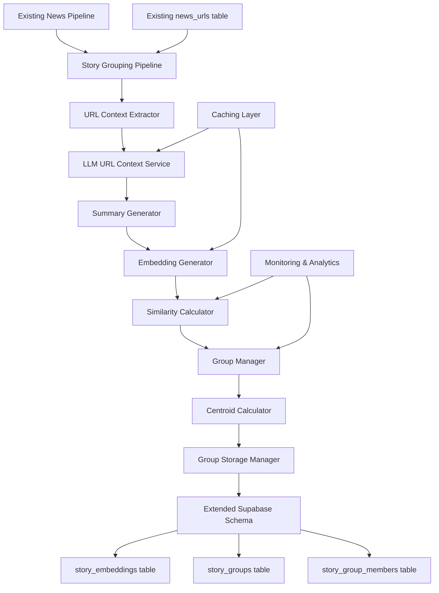

# Design Document: Story Similarity Grouping Feature

## Overview

The Story Similarity Grouping feature extends the existing NFL News Processing Pipeline by implementing intelligent story clustering based on semantic similarity. The system analyzes news stories using embeddings generated from LLM-created contextual summaries, groups similar stories together using centroid-based clustering, and maintains these groupings dynamically as new stories are ingested.

### Key Design Principles

- **LLM URL Context**: Leverage LLM URL context capabilities to generate summaries without crawling content ourselves
- **Semantic Similarity**: Use embeddings to capture story meaning beyond keyword matching
- **Incremental Processing**: Efficiently process new stories against existing groups without full recomputation
- **Centroid-Based Clustering**: Use group centroids for efficient similarity comparison and membership decisions
- **Database Extension**: Extend existing Supabase schema while maintaining current patterns and relationships
- **Cost Optimization**: Implement caching and batching to minimize LLM API costs

## Architecture

### High-Level Architecture



### Component Integration

The story grouping feature integrates with the existing pipeline as a post-processing step:

1. **Pipeline Integration**: Hooks into the existing pipeline after news items are stored
2. **Database Extension**: Adds new tables while maintaining foreign key relationships to existing schema
3. **Processing Flow**: Processes stories individually or in batches after initial ingestion
4. **Error Handling**: Uses existing error handling patterns and audit logging

## Components and Interfaces

### 1. URL Context Extractor

**Purpose**: Generate contextual summaries using LLM URL context capabilities

```python
from typing import Optional, Dict, Any
from dataclasses import dataclass
from datetime import datetime

@dataclass
class ContextSummary:
    url: str
    summary: str
    entities: List[str]
    key_topics: List[str]
    generated_at: datetime
    llm_model: str
    confidence_score: float
    fallback_used: bool = False

class URLContextExtractor:
    def __init__(self, llm_config: Dict[str, Any]):
        self.llm_service = self._initialize_llm_service(llm_config)
        self.cache = ContextCache()
        
    async def extract_context(self, news_item: ProcessedNewsItem) -> ContextSummary:
        """Extract contextual summary using LLM URL context capabilities."""
        
    async def _try_llm_url_context(self, url: str, title: str) -> Optional[ContextSummary]:
        """Use LLM URL context to analyze the story."""
        
    def _fallback_to_metadata(self, news_item: ProcessedNewsItem) -> ContextSummary:
        """Generate summary from available title/description when LLM fails."""
        
    def _normalize_entities(self, entities: List[str]) -> List[str]:
        """Normalize team names, player names for consistent comparison."""
```

### 2. Embedding Generator

**Purpose**: Create semantic embeddings from contextual summaries

```python
import numpy as np
from sentence_transformers import SentenceTransformer
from typing import List, Optional

@dataclass
class StoryEmbedding:
    news_url_id: str
    embedding_vector: np.ndarray
    model_name: str
    model_version: str
    generated_at: datetime
    summary_used: str

class EmbeddingGenerator:
    def __init__(self, model_name: str = "all-MiniLM-L6-v2"):
        self.model = SentenceTransformer(model_name)
        self.model_name = model_name
        self.model_version = self._get_model_version()
        
    async def generate_embedding(self, context_summary: ContextSummary, news_url_id: str) -> StoryEmbedding:
        """Generate normalized embedding vector from context summary."""
        
    def _prepare_embedding_text(self, summary: ContextSummary) -> str:
        """Combine summary, entities, and topics for embedding generation."""
        
    def _normalize_vector(self, vector: np.ndarray) -> np.ndarray:
        """Normalize embedding vector for consistent similarity calculations."""
```

### 3. Similarity Calculator

**Purpose**: Calculate similarity scores between embeddings and manage thresholds

```python
from typing import Tuple, List
from enum import Enum

class SimilarityMetric(Enum):
    COSINE = "cosine"
    EUCLIDEAN = "euclidean"
    DOT_PRODUCT = "dot_product"

@dataclass
class SimilarityResult:
    story1_id: str
    story2_id: str
    similarity_score: float
    metric_used: SimilarityMetric
    calculated_at: datetime

class SimilarityCalculator:
    def __init__(self, similarity_threshold: float = 0.8, metric: SimilarityMetric = SimilarityMetric.COSINE):
        self.threshold = similarity_threshold
        self.metric = metric
        
    def calculate_similarity(self, embedding1: np.ndarray, embedding2: np.ndarray) -> float:
        """Calculate similarity score between two embeddings."""
        
    def find_similar_groups(self, new_embedding: StoryEmbedding, group_centroids: List[GroupCentroid]) -> List[Tuple[str, float]]:
        """Find groups with similarity above threshold."""
        
    def is_similar(self, similarity_score: float) -> bool:
        """Check if similarity score exceeds threshold."""
```

### 4. Group Manager

**Purpose**: Manage story groups, centroids, and membership decisions

```python
from typing import Set, Optional
from enum import Enum

class GroupStatus(Enum):
    NEW = "new"
    UPDATED = "updated"
    STABLE = "stable"

@dataclass
class StoryGroup:
    id: str
    centroid_embedding: np.ndarray
    member_count: int
    status: GroupStatus
    created_at: datetime
    updated_at: datetime
    tags: List[str]
    
@dataclass
class GroupCentroid:
    group_id: str
    centroid_vector: np.ndarray
    member_count: int
    last_updated: datetime

class GroupManager:
    def __init__(self, storage_manager: GroupStorageManager, similarity_calculator: SimilarityCalculator):
        self.storage = storage_manager
        self.similarity_calc = similarity_calculator
        
    async def process_new_story(self, embedding: StoryEmbedding) -> str:
        """Process new story and assign to group or create new group."""
        
    async def find_best_matching_group(self, embedding: StoryEmbedding) -> Optional[Tuple[str, float]]:
        """Find the best matching existing group for a story."""
        
    async def add_story_to_group(self, group_id: str, story_embedding: StoryEmbedding) -> None:
        """Add story to existing group and update centroid."""
        
    async def create_new_group(self, story_embedding: StoryEmbedding) -> str:
        """Create new group with story as initial member."""
        
    async def update_group_centroid(self, group_id: str) -> None:
        """Recalculate group centroid from all member embeddings."""
        
    def _calculate_centroid(self, embeddings: List[np.ndarray]) -> np.ndarray:
        """Calculate centroid from list of embeddings."""
```

### 5. Group Storage Manager

**Purpose**: Handle database operations for story groups and embeddings

```python
from supabase import Client
from typing import List, Optional, Dict, Any

class GroupStorageManager:
    def __init__(self, supabase_client: Client):
        self.supabase = supabase_client
        
    async def store_embedding(self, embedding: StoryEmbedding) -> bool:
        """Store story embedding in database."""
        
    async def store_group(self, group: StoryGroup) -> bool:
        """Store new story group."""
        
    async def add_member_to_group(self, group_id: str, news_url_id: str) -> bool:
        """Add story to group membership table."""
        
    async def get_group_centroids(self) -> List[GroupCentroid]:
        """Retrieve all group centroids for similarity comparison."""
        
    async def get_group_embeddings(self, group_id: str) -> List[StoryEmbedding]:
        """Get all embeddings for a specific group."""
        
    async def update_group_status(self, group_id: str, status: GroupStatus) -> bool:
        """Update group status and timestamp."""
        
    async def get_embedding_by_url_id(self, news_url_id: str) -> Optional[StoryEmbedding]:
        """Check if embedding already exists for a story."""
```

## Data Models

### Extended Database Schema

**story_embeddings table**
```sql
CREATE TABLE story_embeddings (
    id UUID PRIMARY KEY DEFAULT gen_random_uuid(),
    news_url_id UUID NOT NULL REFERENCES news_urls(id) ON DELETE CASCADE,
    embedding_vector VECTOR(1536), -- Default matches OpenAI text-embedding-3-small; adjust if using a different model
    model_name TEXT NOT NULL,
    model_version TEXT NOT NULL,
    summary_text TEXT NOT NULL,
    confidence_score FLOAT NOT NULL,
    generated_at TIMESTAMPTZ DEFAULT NOW(),
    created_at TIMESTAMPTZ DEFAULT NOW()
);

CREATE INDEX idx_story_embeddings_news_url ON story_embeddings(news_url_id);
CREATE INDEX idx_story_embeddings_model ON story_embeddings(model_name, model_version);
-- Vector similarity index for efficient similarity search
CREATE INDEX idx_story_embeddings_vector ON story_embeddings 
USING ivfflat (embedding_vector vector_cosine_ops) WITH (lists = 100);
```

**story_groups table**
```sql
CREATE TABLE story_groups (
    id UUID PRIMARY KEY DEFAULT gen_random_uuid(),
    centroid_embedding VECTOR(1536),
    member_count INTEGER NOT NULL DEFAULT 1,
    status TEXT NOT NULL DEFAULT 'new', -- 'new', 'updated', 'stable'
    tags TEXT[] DEFAULT '{}',
    created_at TIMESTAMPTZ DEFAULT NOW(),
    updated_at TIMESTAMPTZ DEFAULT NOW()
);

CREATE INDEX idx_story_groups_status ON story_groups(status);
CREATE INDEX idx_story_groups_member_count ON story_groups(member_count);
CREATE INDEX idx_story_groups_updated ON story_groups(updated_at);
-- Vector index for centroid similarity search
CREATE INDEX idx_story_groups_centroid ON story_groups 
USING ivfflat (centroid_embedding vector_cosine_ops) WITH (lists = 50);
```

**story_group_members table**
```sql
CREATE TABLE story_group_members (
    id UUID PRIMARY KEY DEFAULT gen_random_uuid(),
    group_id UUID NOT NULL REFERENCES story_groups(id) ON DELETE CASCADE,
    news_url_id UUID NOT NULL REFERENCES news_urls(id) ON DELETE CASCADE,
    similarity_score FLOAT NOT NULL,
    added_at TIMESTAMPTZ DEFAULT NOW(),
    UNIQUE(group_id, news_url_id)
);

CREATE INDEX idx_group_members_group ON story_group_members(group_id);
CREATE INDEX idx_group_members_news_url ON story_group_members(news_url_id);
CREATE INDEX idx_group_members_similarity ON story_group_members(similarity_score);
```

**context_summaries table**
```sql
CREATE TABLE context_summaries (
    id UUID PRIMARY KEY DEFAULT gen_random_uuid(),
    news_url_id UUID NOT NULL REFERENCES news_urls(id) ON DELETE CASCADE,
    summary_text TEXT NOT NULL,
    entities JSONB,
    key_topics TEXT[],
    llm_model TEXT NOT NULL,
    confidence_score FLOAT NOT NULL,
    fallback_used BOOLEAN DEFAULT FALSE,
    generated_at TIMESTAMPTZ DEFAULT NOW(),
    UNIQUE(news_url_id)
);

CREATE INDEX idx_context_summaries_news_url ON context_summaries(news_url_id);
CREATE INDEX idx_context_summaries_model ON context_summaries(llm_model);
CREATE INDEX idx_context_summaries_entities ON context_summaries USING GIN(entities);
```

### Python Data Models Extension

```python
@dataclass
class StoryGroupMember:
    group_id: str
    news_url_id: str
    similarity_score: float
    added_at: datetime

@dataclass
class GroupAnalytics:
    group_id: str
    member_count: int
    avg_similarity: float
    creation_date: datetime
    last_update: datetime
    dominant_entities: List[str]
    story_span_hours: float
```

## Error Handling

### Error Categories and Strategies

1. **LLM API Errors**
   - Rate limiting: Implement exponential backoff with jitter
   - API failures: Fallback to metadata-based summaries
   - Cost limits: Implement daily/monthly spending caps
   - Model unavailability: Switch to alternative models

2. **Embedding Generation Errors**
   - Model loading failures: Retry with different model versions
   - Memory issues: Process in smaller batches
   - Vector dimension mismatches: Validate and normalize dimensions

3. **Similarity Calculation Errors**
   - Invalid vectors: Validate embedding dimensions and values
   - Threshold configuration: Provide sensible defaults and validation
   - Performance issues: Implement similarity search limits

4. **Database Errors**
   - Vector extension issues: Provide clear setup instructions
   - Index creation failures: Implement graceful degradation
   - Foreign key violations: Validate references before operations

### Error Recovery Implementation

```python
class StoryGroupingErrorHandler:
    def __init__(self, max_retries: int = 3, base_delay: float = 1.0):
        self.max_retries = max_retries
        self.base_delay = base_delay
        
    async def handle_llm_error(self, error: Exception, news_item: ProcessedNewsItem) -> ContextSummary:
        """Handle LLM API errors with fallback to metadata."""
        
    async def handle_embedding_error(self, error: Exception, summary: ContextSummary) -> Optional[StoryEmbedding]:
        """Handle embedding generation errors with retry logic."""
        
    async def handle_similarity_error(self, error: Exception, embedding: StoryEmbedding) -> List[Tuple[str, float]]:
        """Handle similarity calculation errors with graceful degradation."""
```

## Testing Strategy

### Unit Testing

1. **URL Context Extraction Testing**
   - Mock LLM API responses for consistent testing
   - Test fallback to metadata when LLM fails
   - Validate entity normalization logic
   - Test caching behavior

2. **Embedding Generation Testing**
   - Test with various summary formats
   - Validate vector normalization
   - Test model loading and initialization
   - Verify embedding dimensions

3. **Similarity Calculation Testing**
   - Test different similarity metrics
   - Validate threshold behavior
   - Test edge cases (identical/opposite vectors)
   - Performance testing with large vector sets

4. **Group Management Testing**
   - Test group creation and membership
   - Validate centroid calculations
   - Test group status transitions
   - Test concurrent group updates

### Integration Testing

1. **End-to-End Story Grouping**
   - Test complete pipeline from URL to group assignment
   - Validate database consistency
   - Test with real news stories
   - Performance testing with large datasets

2. **Database Integration Testing**
   - Test vector similarity searches
   - Validate foreign key relationships
   - Test concurrent access patterns
   - Test backup and recovery procedures

### Performance Testing

1. **Scalability Testing**
   - Test with thousands of stories
   - Validate similarity search performance
   - Test memory usage patterns
   - Test concurrent processing limits

2. **Cost Optimization Testing**
   - Monitor LLM API usage and costs
   - Test caching effectiveness
   - Validate batch processing efficiency

## Performance Considerations

### Optimization Strategies

1. **LLM Cost Optimization**
   - Implement aggressive caching for URL contexts
   - Use batch processing for multiple URLs
   - Implement smart retry logic to avoid duplicate calls
   - Monitor and alert on cost thresholds

2. **Embedding Efficiency**
    - Cache embeddings to avoid regeneration
    - Use efficient embedding models (OpenAI 1536-dimensional default; 384-dimensional applies to fallback local models)
   - Implement batch embedding generation
   - Optimize vector storage and retrieval

3. **Similarity Search Optimization**
   - Use vector indexes (IVFFlat, HNSW) for fast similarity search
   - Implement similarity search limits (top-k results)
   - Use approximate similarity for initial filtering
   - Cache group centroids in memory

4. **Database Performance**
   - Optimize vector indexes for query patterns
   - Implement connection pooling
   - Use batch operations for bulk updates
   - Monitor query performance and optimize

### Monitoring and Metrics

```python
class GroupingMetrics:
    def __init__(self):
        self.llm_api_calls = 0
        self.llm_costs = 0.0
        self.embedding_generations = 0
        self.similarity_calculations = 0
        self.groups_created = 0
        self.groups_updated = 0
        
    def record_llm_usage(self, tokens: int, cost: float):
        """Record LLM API usage and cost."""
        
    def record_grouping_decision(self, decision: str, similarity_score: float):
        """Record group assignment decisions."""
        
    def generate_performance_report(self) -> Dict[str, Any]:
        """Generate comprehensive performance metrics."""
```

## Security Considerations

### Data Protection

1. **API Key Management**
   - Store LLM API keys securely in environment variables
   - Implement key rotation procedures
   - Monitor API usage for anomalies
   - Implement spending limits and alerts

2. **Vector Data Security**
   - Encrypt embedding vectors at rest
   - Implement access controls for similarity searches
   - Audit vector data access patterns
   - Secure vector index operations

3. **Privacy Compliance**
   - Ensure URL context extraction respects privacy policies
   - Implement data retention policies for embeddings
   - Provide data deletion capabilities
   - Audit all data processing operations

## Deployment and Operations

### Configuration Management

```yaml
# story_grouping_config.yaml
llm:
  provider: "openai"  # or "google"
  model: "gpt-5-nano"  # or "gemini-2.5-lite"
  api_key_env: "OPENAI_API_KEY"
  max_tokens: 500
  temperature: 0.1
  timeout_seconds: 30

embedding:
    model_name: "text-embedding-3-small"
    dimension: 1536
  batch_size: 32
  cache_ttl_hours: 24

similarity:
  threshold: 0.8
  metric: "cosine"
  max_candidates: 100
  search_limit: 1000

grouping:
  max_group_size: 50
  centroid_update_threshold: 5
  status_transition_hours: 24
  auto_tagging: true

performance:
  parallel_processing: true
  max_workers: 4
  batch_size: 10
  cache_size: 1000
```

### Monitoring and Alerting

1. **Operational Metrics**
   - Story processing throughput
   - Group formation rates
   - Similarity search performance
   - Database operation latency

2. **Cost Monitoring**
   - LLM API usage and costs
   - Embedding generation costs
   - Database storage costs
   - Alert thresholds for budget management

3. **Quality Metrics**
   - Group coherence scores
   - False positive/negative rates
   - User feedback on groupings
   - Manual validation results

This design provides a comprehensive, scalable, and maintainable foundation for the story similarity grouping feature while integrating seamlessly with the existing NFL news pipeline infrastructure.