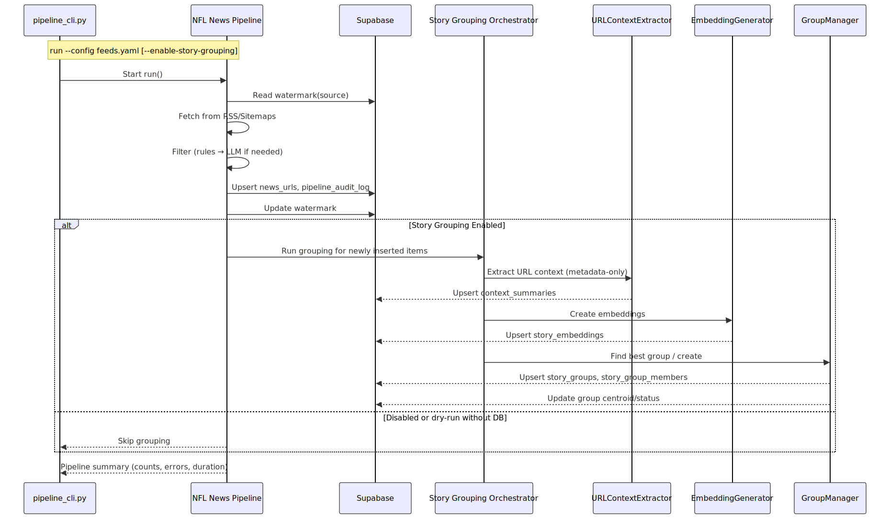

# T4LAPIs – NFL News, Data, and AI Content Platform

<p align="left">
  <a href="https://github.com/BigSlikTobi/T4LAPIs/actions">
    
  </a>
  <a href="#testing">
    
  </a>
  <a href="https://www.python.org/downloads/release/python-3110/">
    
  </a>
  <a href="Dockerfile">
    
  </a>
  <a href="LICENSE">
    
  </a>
  <!-- Optional coverage: set to your Codecov/Coveralls URL when available -->
  <a href="#testing">
    
  </a>
  <!-- Optional: add PyPI/Container Registry badges if you publish artifacts -->
</p>

One unified toolkit to fetch, filter, group, and serve NFL news and data—complete with automation, an API, and AI-generated summaries. This README consolidates all docs and explains how to run every feature for both non-technical and technical users.

• New here? Start with Quick Start.  
• Want details? See Vision, requirements, and design.  
• Just run it? Jump to How to run every feature.

## Table of Contents

- [Quick Start (5 minutes)](#quick-start-5-minutes)
- [What this project does](#what-this-project-does)
- [At-a-glance features](#at-a-glance-features)
- [Repository map](#repository-map-high-level)
- [Business processes](#business-processes)
- [Visual architecture and flow](#visual-architecture-and-flow)
- [Vision, requirements, and design](#vision-requirements-and-design)
- [Install and setup](#install-and-setup)
- [Configuration](#configuration-what-to-edit-and-how-to-use-it)
- [How the scripts work](#how-the-scripts-work-friendly-overview)
- [How to run every feature](#how-to-run-every-feature)
- [Entity linking DB setup (optional)](#entity-linking-db-setup-optional-but-recommended)
- [Docker quick start](#docker-quick-start)
- [Deployment scripts (story grouping)](#deployment-scripts-story-grouping)
- [Testing](#testing)
- [Troubleshooting and tips](#troubleshooting-and-tips)
- [Links to all docs](#links-to-all-docs-one-place)
- [License and contributions](#license-and-contributions)
- [Thanks](#thanks)

## Quick Start (5 minutes)

Prerequisites
- Python 3.11+

Steps
1) Clone and set up a virtual environment
```
git clone https://github.com/BigSlikTobi/T4LAPIs.git
cd T4LAPIs
python3 -m venv .venv && source .venv/bin/activate
pip install -r requirements.txt
```

2) Dry-run a few features (no DB writes, no API keys needed)
```
# List pipeline sources then dry-run (grouped under scripts/news_ingestion)
python scripts/news_ingestion/pipeline_cli.py list-sources --config feeds.yaml
python scripts/news_ingestion/pipeline_cli.py run --config feeds.yaml --dry-run --disable-llm

# Try a data loader
python scripts/data_loaders/teams_cli.py --dry-run
```

3) Optional: start the API
```
cd api && python main.py
# Open http://localhost:8000/docs
```

For full setup (DB + LLM), see Install and setup.

## What this project does

- Collects NFL news URLs and metadata from RSS/sitemaps defined in `feeds.yaml` (no page scraping)
- Filters for NFL relevance (rules + optional LLM assist) and writes to Supabase
- Groups similar stories via embeddings + LLM URL-context to track story evolution
- Loads core NFL datasets (teams, players, games, weekly stats)
- Generates AI content (personalized updates, trending summaries)
- Exposes a FastAPI for user and preference management
- Automates all the above with smart update scripts and GitHub Actions

## At-a-glance features

- NFL news pipeline with incremental watermarks and audit trail
- Story similarity grouping (centroid-based, incremental)
- LLM-assisted entity extraction and URL-context (configurable, cacheable)
- Data loaders and auto-update scripts for teams, players, games, and stats
- AI content: personalized updates and trending summaries
- FastAPI with 7 endpoints for users and preferences
- Dockerized, tested, and documented

## Repository map (high level)

```
api/                         # FastAPI (7 endpoints, Swagger/ReDoc)
content_generation/          # AI generators: personal & trending summaries
docs/                        # Reference docs (linked below)
examples/                    # Small demos to try features
scripts/
  news_ingestion/            # Pipeline CLI + demos (README included)
  story_grouping/            # Grouping demos, dry-run, batch, deploy (README)
  data_loaders/              # Teams/Players/Games/Stats CLIs + stats/ (README)
  auto_updates/              # Automated update scripts (README)
  entity_linking/            # Entity dictionary + LLM linker (README)
  content_generation/        # Trending detection + summaries (README)
  ops_utilities/             # Helper and functionality checks (README)
db/migrations/               # SQL migrations (incl. story grouping schema)
```

For an easy first run, read [docs/Getting_Started.md](docs/Getting_Started.md).

## Business processes

This repository groups operational scripts into business processes. Each folder contains a README with purpose, usage, and guidance.

- News Ingestion: Configure and run the news pipeline via scripts/news_ingestion.
  - Start here: [scripts/news_ingestion/README.md](scripts/news_ingestion/README.md)
- Story Grouping: Extract context, embed, and cluster via scripts/story_grouping.
  - Details: [scripts/story_grouping/README.md](scripts/story_grouping/README.md)
- Data Loaders: Load teams, players, games, stats via scripts/data_loaders.
  - Overview: [scripts/data_loaders/README.md](scripts/data_loaders/README.md)
- Auto Updates: CI-friendly updates for games and weekly stats under scripts/auto_updates.
  - Usage: [scripts/auto_updates/README.md](scripts/auto_updates/README.md)
- Entity Linking: Build dictionaries and link entities with or without LLM under scripts/entity_linking.
  - Guide: [scripts/entity_linking/README.md](scripts/entity_linking/README.md)
- Content Generation: Detect trending entities and generate summaries under scripts/content_generation.
  - Guide: [scripts/content_generation/README.md](scripts/content_generation/README.md)

## Visual architecture and flow

The diagrams below connect the NFL News Pipeline and Story Similarity Grouping and show how features within each flow together.





Tips
- Toggle story grouping with --enable-story-grouping or env NEWS_PIPELINE_ENABLE_STORY_GROUPING=1.
- To rerun everything regardless of prior watermarks, use --ignore-watermark or env NEWS_PIPELINE_IGNORE_WATERMARK=1.
- Use --dry-run to explore without DB writes; grouping requires a real DB client (Supabase) to persist results.

### DB legend (key tables and payloads)

- news_urls: One row per ingested URL with public metadata only
    - Columns: id, source, publisher, url (unique), title, published_at, description, relevance_score, created_at, updated_at
- source_watermarks: Per-source incremental cursor
    - Columns: id, source (unique), last_processed_at, updated_at
- pipeline_audit_log: Filtering decisions and rationale per URL
    - Columns: id, news_url_id (fk -> news_urls), stage (rule|llm), method, score, rationale, model_id, created_at
- context_summaries: LLM URL-context summary (metadata-only)
    - Columns: id, news_url_id (fk -> news_urls), summary_text, model_id, created_at
- story_embeddings: Vector embedding for each context summary
    - Columns: id, news_url_id (fk -> news_urls), embedding_vector, model_name, model_version, generated_at, confidence_score
- story_groups: Group metadata and centroid
    - Columns: id, centroid_embedding, member_count, status (new|updated|stable), tags[], created_at, updated_at
- story_group_members: Membership join table
    - Columns: id, group_id (fk -> story_groups), news_url_id (fk -> news_urls), similarity_score, added_at

### Diagrams

Static SVGs are included under docs/diagrams/ for portability:
- docs/diagrams/architecture-flow.svg
- docs/diagrams/pipeline-sequence.svg

## Vision, requirements, and design

These documents define what we’re building and how it works under the hood:

- Product requirements (news pipeline): docs/specs/nfl-news-pipeline/requirements.md
- Design (news pipeline): docs/specs/nfl-news-pipeline/design.md
- Product requirements (story grouping): docs/specs/story-similarity-grouping/requirements.md
- Design (story grouping): docs/specs/story-similarity-grouping/design.md

Additional how-tos and deep dives:

- Getting Started: [docs/Getting_Started.md](docs/Getting_Started.md)
- CLI Tools Guide: [docs/CLI_Tools_Guide.md](docs/CLI_Tools_Guide.md)
- Automation Workflows: [docs/Automation_Workflows.md](docs/Automation_Workflows.md)
- Auto-Update Scripts: [docs/Auto_Update_Scripts.md](docs/Auto_Update_Scripts.md)
- Story Grouping Integration: [docs/story_grouping_integration.md](docs/story_grouping_integration.md)
- Story Grouping Config: [docs/Story_Grouping_Configuration.md](docs/Story_Grouping_Configuration.md)
- API Reference: [docs/API_Reference.md](docs/API_Reference.md)
- NFL Data Reference: [docs/NFL_Data_Reference.md](docs/NFL_Data_Reference.md)
- Testing Guide: [docs/Testing_Guide.md](docs/Testing_Guide.md)
- Technical Details: [docs/Technical_Details.md](docs/Technical_Details.md)
- Troubleshooting: [docs/Troubleshooting.md](docs/Troubleshooting.md)
- LLM Test Coverage: [docs/LLM_Test_Coverage.md](docs/LLM_Test_Coverage.md)
- Story Grouping Test Summary: [docs/Story_Grouping_Test_Coverage_Summary.md](docs/Story_Grouping_Test_Coverage_Summary.md)

## Install and setup

Prerequisites
- Python 3.11+
- macOS/Linux/Windows
- Optional: Supabase project (for DB writes)
- Optional: LLM API key(s) for AI features

Install
```
git clone https://github.com/BigSlikTobi/T4LAPIs.git
cd T4LAPIs
python3 -m venv .venv
source .venv/bin/activate  # macOS/Linux
pip install -r requirements.txt
```

Environment (only required for DB writes or LLM features)
```
# Create .env at the repo root and add as needed
SUPABASE_URL=your_supabase_url
SUPABASE_KEY=your_supabase_service_or_anon_key

# Optional LLM keys
OPENAI_API_KEY=...
GEMINI_API_KEY=...
DEEPSEEK_API_KEY=...

# Optional tuning
LOG_LEVEL=INFO
```

Tip: Most commands support --dry-run so you can explore safely without DB writes.

## Configuration: what to edit and how to use it

There are two configuration layers:

1) feeds.yaml (root)
    - Defines sources for the news pipeline (RSS/sitemaps/HTML) and per-source options
    - Also supports top-level defaults and optional story-grouping toggles (see example below)
    - Typical commands use this file via --config feeds.yaml

2) story_grouping_config.yaml (root)
    - Detailed settings for the story similarity grouping feature (LLM, embeddings, thresholds, performance, monitoring)
    - Loaded by grouping scripts and the pipeline when grouping is enabled

Recommended setup
- Keep feeds.yaml as your primary pipeline config.
- Keep story_grouping_config.yaml for grouping-specific tuning.

Example: enable grouping in feeds.yaml
```
defaults:
  enable_story_grouping: true
  story_grouping_max_parallelism: 4
  story_grouping_max_stories_per_run: 100
```

Run with grouping on (dry run)
```
python scripts/news_ingestion/pipeline_cli.py run --config feeds.yaml --enable-story-grouping --dry-run
```

Where to find a fuller example
- docs/examples/feeds_with_story_grouping.yaml – a complete feeds.yaml variant with grouping options enabled.

Environment overrides
- NEWS_PIPELINE_ENABLE_STORY_GROUPING=1 to force-enable grouping
- LOG_LEVEL, OPENAI_API_KEY, GEMINI_API_KEY, DEEPSEEK_API_KEY as needed (see story_grouping_config.yaml for details)

## How the scripts work (friendly overview)

This project is script-first: each feature is a CLI. Here’s what they do and when to use them.

News pipeline and grouping
- scripts/news_ingestion/pipeline_cli.py: Orchestrates the news pipeline (list/validate/run/status). Can also run story grouping: group-stories, group-backfill, group-status, group-report.
- scripts/story_grouping/story_grouping_dry_run.py: Run story grouping logic without writing to DB (good for demos).
- scripts/story_grouping/story_grouping_batch_processor.py: Backfill older stories in batches with resume support.
- scripts/story_grouping/story_grouping_cli_demo.py: Small CLI demo for grouping flows.

AI and entity tools
- scripts/entity_linking/llm_entity_linker_cli.py: Use an LLM to extract and validate entities in articles (test, run, stats).
- scripts/entity_linking/entity_dictionary_cli.py: Inspect and manage the internal entity dictionary (search, stats, export).
- scripts/content_generation/trending_summary_generator.py: Create summaries for trending teams/players; can read from stdin for pipeline chaining.
- scripts/content_generation/trending_topic_detector.py: Detect trending entities using recent content and signals.

NFL data loaders and auto-updaters
- scripts/data_loaders/teams_cli.py: Load teams.
- scripts/data_loaders/players_cli.py: Load player rosters for seasons.
- scripts/data_loaders/games_cli.py: Load schedules/results per season/week.
- scripts/data_loaders/player_weekly_stats_cli.py: Load weekly player stats.
- scripts/auto_updates/games_auto_update.py: Smart weekly game updater (current and next week).
- scripts/auto_updates/player_weekly_stats_auto_update.py: Smart player stats updater (gaps + recent corrections).

Utilities and demos
- scripts/entity_linking/setup_entity_linking_db.py: Create indexes/structures used by entity linking.
- scripts/news_ingestion/news_fetch_demo.py and examples/*: Simple demos to see parts of the system in action.
- scripts/story_grouping/live_story_context_test.py: Quick test of URL-context capabilities.

Deployment helpers
- scripts/story_grouping/deploy_story_grouping.py: Validate/setup/configure story grouping end-to-end (validate, setup, config, test, deploy).
- scripts/story_grouping/deploy_story_grouping.sh: Shell wrapper to validate environment and deploy with flags.

Database migrations
- db/migrations/002_story_grouping_schema.sql: Schema for story embeddings, groups, and membership. Apply in Supabase SQL editor if you plan to use story grouping in production.

## How to run every feature

Add --dry-run to preview without writing to DB.

1) News Pipeline (fetch → filter → store)

```
# List configured sources
python scripts/news_ingestion/pipeline_cli.py list-sources --config feeds.yaml

# Validate config
python scripts/news_ingestion/pipeline_cli.py validate --config feeds.yaml

# Dry run all sources (no DB writes, no LLM)
python scripts/news_ingestion/pipeline_cli.py run --config feeds.yaml --dry-run --disable-llm

# Run a single source (writes to DB if .env set)
python scripts/news_ingestion/pipeline_cli.py run --config feeds.yaml --source espn

# Status and health
python scripts/news_ingestion/pipeline_cli.py status --config feeds.yaml
```

2) Story Grouping (semantic clustering of similar stories)

Enable via config or env

```
# feeds.yaml
defaults:
    enable_story_grouping: true
    story_grouping_max_parallelism: 4
    story_grouping_max_stories_per_run: 100
```

```
export NEWS_PIPELINE_ENABLE_STORY_GROUPING=1
```

Run it

```
# Run pipeline with grouping
python scripts/news_ingestion/pipeline_cli.py run --enable-story-grouping --dry-run

# Manual grouping of recent items
python scripts/news_ingestion/pipeline_cli.py group-stories --max-stories 50 --dry-run

# Backfill at scale
python scripts/news_ingestion/pipeline_cli.py group-backfill --batch-size 25 --dry-run

# Status and report
python scripts/news_ingestion/pipeline_cli.py group-status
python scripts/news_ingestion/pipeline_cli.py group-report --format json
```

3) LLM Entity Linking (players/teams from text)

```
# Quick test
python scripts/entity_linking/llm_entity_linker_cli.py test --text "Patrick Mahomes shines as Chiefs beat 49ers"

# Process unlinked articles in batches
python scripts/entity_linking/llm_entity_linker_cli.py run --batch-size 20 --max-batches 5

# Stats
python scripts/entity_linking/llm_entity_linker_cli.py stats
```

Recommended DB helper: in Supabase SQL editor, add a function to fetch unlinked articles efficiently. See the “Manual DB function” snippet in this README under “Entity linking DB setup.”

4) AI Content Generation

Trending summaries

```
# Detect trending entities
python scripts/content_generation/trending_topic_detector.py --hours 168 --top-n 5

# Generate summaries (direct)
python content_generation/trending_summary_generator.py --entity-ids "KC,00-0033873" --dry-run

# Pipeline (detector → generator)
python scripts/content_generation/trending_topic_detector.py --entity-ids-only | \
    python content_generation/trending_summary_generator.py --from-stdin
```

Personalized user updates

```
python content_generation/personal_summary_generator.py
```

5) NFL Data Loaders (teams/players/games/stats)

```
# Teams
python scripts/data_loaders/teams_cli.py --dry-run

# Players (one or more seasons)
python scripts/data_loaders/players_cli.py 2024 --dry-run

# Games (season or a specific week)
python scripts/data_loaders/games_cli.py 2024 --dry-run
python scripts/data_loaders/games_cli.py 2024 --week 1 --dry-run

# Player weekly stats
python scripts/data_loaders/player_weekly_stats_cli.py 2024 --weeks 1 2 3 --dry-run
```

6) Smart Auto-Update (for CI and ops)

```
# Games: upsert current week + insert next week
python scripts/auto_updates/games_auto_update.py

# Player stats: fill gaps + update recent corrections
python scripts/auto_updates/player_weekly_stats_auto_update.py
```

7) FastAPI (users and preferences)

```
cd api
python main.py

# Docs
# http://localhost:8000/docs (Swagger)
# http://localhost:8000/redoc (ReDoc)
```

Docker option

```
cd api
docker-compose up -d --build
```

8) Examples and additional runners

```
# Examples
python examples/embedding_demo.py
python examples/fetch_data_example.py
python examples/main_fetch_demo.py

# Demos (story grouping, monitoring, and internals)
python examples/demo_story_grouping.py
python examples/demo_similarity_grouping.py
python examples/demo_group_manager.py
python examples/demo_group_storage_manager.py
python examples/demo_monitoring.py

# Injury and roster update runners (basic entry points)
python injury_updates/main.py
python roster_updates/main.py

# See help for options where available
python injury_updates/main.py -h || true
python roster_updates/main.py -h || true
```

Examples overview
- examples/demo_story_grouping.py: End-to-end story grouping flow (dry-run friendly)
- examples/demo_similarity_grouping.py: Similarity scoring and centroid grouping on a small set
- examples/demo_group_manager.py: Low-level group manager operations (create/update/merge)
- examples/demo_group_storage_manager.py: Storage-layer CRUD against DB (requires .env DB config)
- examples/demo_monitoring.py: Monitoring metrics, alerts, and analytics showcase
- examples/embedding_demo.py: Generate embeddings and compute pairwise similarities
- examples/fetch_data_example.py: Fetch news data via configured feeds
- examples/main_fetch_demo.py: Orchestrated fetch run with status output

Tip: Use --dry-run where available to explore safely without DB writes. For storage demos, ensure your .env has Supabase credentials.

## Entity linking DB setup (optional but recommended)

For optimal performance when running `llm_entity_linker_cli.py run`, add this helper in Supabase (SQL editor):

```
CREATE OR REPLACE FUNCTION get_unlinked_articles(batch_limit INTEGER)
RETURNS SETOF "SourceArticles" AS $$
BEGIN
        RETURN QUERY
        SELECT sa.*
        FROM "SourceArticles" sa
        WHERE NOT EXISTS (
                SELECT 1
                FROM "article_entity_links" ael
                WHERE ael.article_id = sa.id
        )
        AND sa."contentType" IN ('news_article', 'news-round-up', 'topic_collection')
        AND sa."Content" IS NOT NULL
        AND sa."Content" != ''
        ORDER BY sa.id
        LIMIT batch_limit;
END;
$$ LANGUAGE plpgsql;
```

## Docker quick start

```
docker build -t t4lapis-app .
docker run --rm --env-file .env t4lapis-app python scripts/data_loaders/teams_cli.py --dry-run
```

## Deployment scripts (story grouping)

Python-based deployment and validation

```
python scripts/story_grouping/deploy_story_grouping.py validate --verbose
python scripts/story_grouping/deploy_story_grouping.py setup
python scripts/story_grouping/deploy_story_grouping.py test
python scripts/story_grouping/deploy_story_grouping.py config --config-path=story_grouping_config.yaml
```

Shell-based convenience (validation and deploy flags)

```
./scripts/story_grouping/deploy_story_grouping.sh --dry-run
./scripts/story_grouping/deploy_story_grouping.sh --environment=prod
```

## Testing

```
python -m pytest -q
```

For deeper testing topics (coverage, LLM tests, API tests), see: docs/Testing_Guide.md and docs/LLM_Test_Coverage.md.

Developer validation scripts
- For quick, print-based local checks (without pytest), see tools/validation/.
- Examples:
    - python tools/validation/test_configuration_integration.py
    - python tools/validation/test_workflow.py
    - python tools/validation/test_fallback_query.py

### Developer tasks (VS Code)

If you use VS Code, convenient tasks are available under .vscode/tasks.json:
- Open the Command Palette → "Run Task" and choose one of:
    - Setup: Create venv and install deps – run this once to create .venv and install dependencies
    - Validation: All – runs all scripts in tools/validation
    - Demos: All – runs all demos in examples
    - Tests: Pytest (quiet) – runs the test suite (pytest -q)
    - You can also run each validation/demo individually


## Troubleshooting and tips

- No DB? Use --dry-run everywhere to explore without writes.
- Slow/blocked LLM? Add --disable-llm to the pipeline or omit LLM features.
- Invalid seasons/weeks? Check CLI help; start small (one week).
- Story grouping slow? Lower max parallelism or limit max stories per run.
- DB schema for grouping: apply db/migrations/002_story_grouping_schema.sql in Supabase.

More: docs/Troubleshooting.md

## Links to all docs (one place)

- Configuration Guide: [docs/Configuration.md](docs/Configuration.md)
- Getting Started: [docs/Getting_Started.md](docs/Getting_Started.md)
- CLI Tools Guide: [docs/CLI_Tools_Guide.md](docs/CLI_Tools_Guide.md)
- Auto-Update Scripts: [docs/Auto_Update_Scripts.md](docs/Auto_Update_Scripts.md)
- Story Grouping Integration: [docs/story_grouping_integration.md](docs/story_grouping_integration.md)
- Story Grouping Configuration: [docs/Story_Grouping_Configuration.md](docs/Story_Grouping_Configuration.md)
- API Reference: [docs/API_Reference.md](docs/API_Reference.md)
- NFL Data Reference: [docs/NFL_Data_Reference.md](docs/NFL_Data_Reference.md)
- Automation Workflows: [docs/Automation_Workflows.md](docs/Automation_Workflows.md)
- Testing Guide: [docs/Testing_Guide.md](docs/Testing_Guide.md)
- Monitoring Guide: [docs/Monitoring_Guide.md](docs/Monitoring_Guide.md)
- Technical Details: [docs/Technical_Details.md](docs/Technical_Details.md)
- Troubleshooting: [docs/Troubleshooting.md](docs/Troubleshooting.md)
- LLM Test Coverage: [docs/LLM_Test_Coverage.md](docs/LLM_Test_Coverage.md)
- Story Grouping Test Summary: [docs/Story_Grouping_Test_Coverage_Summary.md](docs/Story_Grouping_Test_Coverage_Summary.md)
- Requirements (News pipeline): [docs/specs/nfl-news-pipeline/requirements.md](docs/specs/nfl-news-pipeline/requirements.md)
- Design (News pipeline): [docs/specs/nfl-news-pipeline/design.md](docs/specs/nfl-news-pipeline/design.md)
- Requirements (Story grouping): [docs/specs/story-similarity-grouping/requirements.md](docs/specs/story-similarity-grouping/requirements.md)
- Design (Story grouping): [docs/specs/story-similarity-grouping/design.md](docs/specs/story-similarity-grouping/design.md)

Archived summaries: docs/archive/

## License and contributions

MIT License (see LICENSE). PRs welcome—please include tests when changing public behavior.

## Thanks

- nfl_data_py, Supabase, and the broader NFL analytics community.
