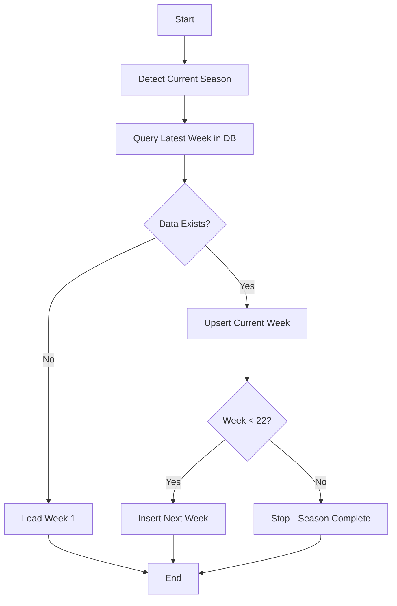
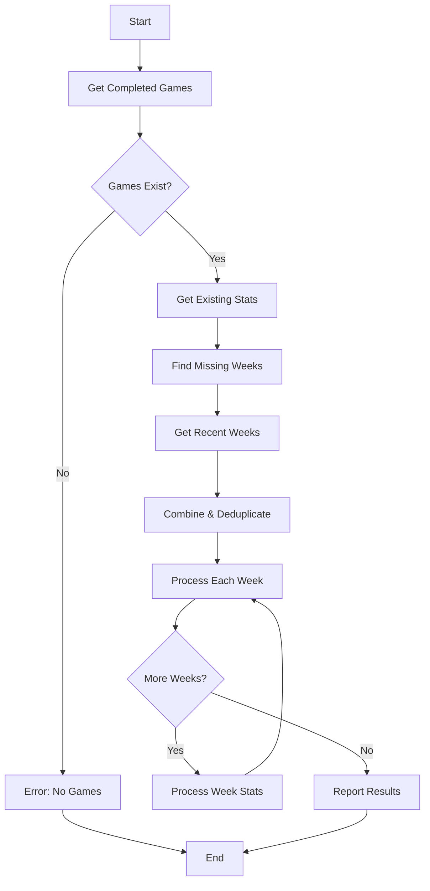

# Auto-Update Scripts

This document describes the intelligent auto-update scripts that power the automated NFL data workflows in GitHub Actions.

## 🤖 Overview

The auto-update scripts provide smart, incremental data updating capabilities that go beyond simple data fetching. They include intelligent detection logic, gap analysis, and error resilience to ensure data stays current with minimal redundant processing.

### Key Features

- ✅ **Smart Detection**: Automatically detect current NFL season and latest data
- ✅ **Gap Analysis**: Compare database state with available data to find missing pieces
- ✅ **Incremental Updates**: Only process new or changed data
- ✅ **Error Resilience**: Continue processing despite partial failures
- ✅ **Recent Week Updates**: Handle late-arriving corrections and updates

## 📊 Available Auto-Update Scripts

| Script | Purpose | Frequency | Intelligence Features |
|--------|---------|-----------|----------------------|
| `games_auto_update.py` | Game schedules & results | 6x/week | Season detection, week progression |
| `player_weekly_stats_auto_update.py` | Player statistics | Weekly | Gap detection, recent updates |

## 🏈 Games Auto-Update (`games_auto_update.py`)

The games auto-update script handles NFL game data with intelligent week detection and dual update strategy.

### Smart Features

#### 1. Automatic Season Detection
```python
def get_current_nfl_season(test_date=None):
    """
    Determine current NFL season based on date.
    NFL seasons run September (start) to August (end).
    
    Examples:
    - September 15, 2024 → 2024 season
    - February 15, 2025 → 2024 season (playoffs/offseason)
    """
    date = test_date or datetime.now()
    if date.month >= 9:  # September or later
        return date.year
    else:  # January through August
        return date.year - 1
```

#### 2. Latest Week Detection
```python
def get_latest_week_from_db(season):
    """
    Find the most recent week with games in the database.
    Returns 0 if no games exist for the season.
    """
    query = """
    SELECT MAX(week) as max_week 
    FROM games 
    WHERE season = %s
    """
    result = execute_query(query, [season])
    return result['max_week'] or 0
```

#### 3. Dual Update Strategy
```python
def main():
    """
    Smart update logic:
    1. Upsert current week (catch score updates, time changes)
    2. Insert next week (new game schedules)
    """
    season = get_current_nfl_season()
    latest_week = get_latest_week_from_db(season)
    
    if latest_week == 0:
        # No data exists - start with week 1
        process_week(season, 1, operation='insert')
    else:
        # Update current week (scores may have changed)
        process_week(season, latest_week, operation='upsert')
        
        # Add next week if within season bounds
        if latest_week < 22:
            process_week(season, latest_week + 1, operation='insert')
```

### Execution Flow



### Error Handling

```python
def process_week(season, week, operation='insert'):
    """Process a single week with comprehensive error handling"""
    try:
        # Fetch data from NFL API
        games_df = fetch_games_for_week(season, week)
        
        if games_df.empty:
            logger.warning(f"No games found for {season} week {week}")
            return False
            
        # Transform and load data
        loader = GamesLoader()
        on_conflict = "game_id" if operation == 'upsert' else None
        success = loader.load(games_df, on_conflict=on_conflict)
        
        logger.info(f"Successfully {operation}ed {len(games_df)} games for {season} week {week}")
        return success
        
    except Exception as e:
        logger.error(f"Failed to process {season} week {week}: {e}")
        return False
```

## 📈 Player Stats Auto-Update (`player_weekly_stats_auto_update.py`)

The player stats auto-update script uses cross-table analysis to identify missing statistics and recent weeks needing updates.

### Smart Features

#### 1. Cross-Table Gap Analysis
```python
def get_games_weeks_from_db():
    """Get all weeks that have completed games"""
    query = """
    SELECT DISTINCT season, week 
    FROM games 
    WHERE away_score IS NOT NULL 
      AND home_score IS NOT NULL
    ORDER BY season, week
    """
    return execute_query(query)

def get_stats_weeks_from_db():
    """Get all weeks that have player statistics"""
    query = """
    SELECT DISTINCT season, week 
    FROM player_weekly_stats
    ORDER BY season, week
    """
    return execute_query(query)

def find_missing_weeks():
    """Find weeks with games but no statistics"""
    games_weeks = set((row['season'], row['week']) for row in get_games_weeks_from_db())
    stats_weeks = set((row['season'], row['week']) for row in get_stats_weeks_from_db())
    
    missing_weeks = games_weeks - stats_weeks
    return sorted(list(missing_weeks))
```

#### 2. Recent Week Update Strategy
```python
def get_recent_weeks(num_weeks=2):
    """
    Get the most recent weeks for re-processing.
    This handles late stat corrections and updates.
    """
    query = """
    SELECT DISTINCT season, week 
    FROM games 
    WHERE away_score IS NOT NULL 
      AND home_score IS NOT NULL
    ORDER BY season DESC, week DESC
    LIMIT %s
    """
    return execute_query(query, [num_weeks])
```

#### 3. Intelligent Processing Logic
```python
def main():
    """
    Smart statistics update logic:
    1. Find gaps between games and stats
    2. Always update recent weeks (corrections)
    3. Process only necessary weeks
    """
    # Check if games data exists
    games_weeks = get_games_weeks_from_db()
    if not games_weeks:
        logger.error("No completed games found - cannot process stats")
        return False
    
    # Find missing weeks
    missing_weeks = find_missing_weeks()
    
    # Get recent weeks for updates
    recent_weeks = get_recent_weeks(2)
    
    # Combine and deduplicate
    weeks_to_process = list(set(missing_weeks + recent_weeks))
    weeks_to_process.sort()
    
    logger.info(f"Processing {len(weeks_to_process)} weeks: {weeks_to_process}")
    
    # Process each week
    success_count = 0
    for season, week in weeks_to_process:
        if process_stats_for_week(season, week):
            success_count += 1
    
    logger.info(f"Successfully processed {success_count}/{len(weeks_to_process)} weeks")
    return success_count > 0
```

### Execution Flow



## 🔧 Configuration and Setup

### Environment Requirements

```bash
# Required environment variables
SUPABASE_URL=your_supabase_url
SUPABASE_KEY=your_supabase_key

# Optional configuration
LOG_LEVEL=INFO
DATABASE_TIMEOUT=30
```

### Manual Execution

```bash
# Run games auto-update
python scripts/games_auto_update.py

# Run player stats auto-update  
python scripts/player_weekly_stats_auto_update.py

# Run with debug logging
LOG_LEVEL=DEBUG python scripts/games_auto_update.py
```

### Docker Execution

```bash
# Run in Docker with environment file
docker run --rm --env-file .env t4lapis-app python scripts/games_auto_update.py

# Interactive debugging
docker run --rm -it --env-file .env t4lapis-app bash
python scripts/games_auto_update.py
```

## 🚨 Error Handling and Recovery

### Error Categories

1. **Database Connection Errors**
   ```python
   try:
       client = get_supabase_client()
   except Exception as e:
       logger.error(f"Database connection failed: {e}")
       return False
   ```

2. **API Data Errors**
   ```python
   try:
       games_df = nfl.import_schedules([season])
   except Exception as e:
       logger.error(f"Failed to fetch NFL data: {e}")
       continue  # Try next week
   ```

3. **Processing Errors**
   ```python
   try:
       loader.load(stats_df, on_conflict="stat_id")
   except ValidationError as e:
       logger.warning(f"Data validation failed: {e}")
       # Continue with other weeks
   ```

### Recovery Strategies

1. **Graceful Degradation**: Continue processing other weeks if one fails
2. **Comprehensive Logging**: Detailed error information for debugging
3. **State Preservation**: Don't corrupt existing data on partial failures
4. **Manual Recovery**: Failed runs can be re-executed manually

## 📊 Monitoring and Metrics

### Logging Output

```
2024-01-15 05:00:00 - games_auto_update - INFO - Detected current season: 2024
2024-01-15 05:00:01 - games_auto_update - INFO - Latest week in database: 10
2024-01-15 05:00:02 - games_auto_update - INFO - Upserting 16 games for 2024 week 10
2024-01-15 05:00:05 - games_auto_update - INFO - Inserting 16 games for 2024 week 11
2024-01-15 05:00:08 - games_auto_update - INFO - Auto-update completed successfully
```

### Key Metrics

- **Execution Time**: Total script runtime
- **Records Processed**: Number of games/stats processed
- **Success Rate**: Percentage of successful operations
- **Weeks Processed**: Number of weeks updated
- **Error Count**: Number of errors encountered

### GitHub Actions Integration

```yaml
# Example workflow step
- name: Update Games Data
  run: python scripts/games_auto_update.py
  env:
    SUPABASE_URL: ${{ secrets.SUPABASE_URL }}
    SUPABASE_KEY: ${{ secrets.SUPABASE_KEY }}
```

## 🧪 Testing

### Test Coverage

Both auto-update scripts have comprehensive test suites covering:

1. **Normal Operation Scenarios**
2. **Edge Cases** (no data, season boundaries)
3. **Error Conditions** (database failures, API errors)
4. **Season Detection Logic**
5. **Gap Analysis Logic**

### Test Examples

```python
def test_get_current_nfl_season_september():
    """Test season detection in September"""
    test_date = datetime(2024, 9, 15)
    season = get_current_nfl_season(test_date)
    assert season == 2024

def test_main_no_existing_data():
    """Test first run with no existing data"""
    # Mock empty database
    # Verify week 1 is loaded
    
def test_main_with_existing_data():
    """Test normal operation with existing data"""
    # Mock database with week 5 data
    # Verify week 5 is upserted, week 6 is inserted
```

## 🎯 Future Enhancements

### Planned Improvements

1. **Dynamic Scheduling**: Adjust update frequency based on NFL calendar
2. **Advanced Gap Detection**: More sophisticated missing data identification
3. **Performance Optimization**: Reduce execution time and resource usage
4. **Enhanced Error Recovery**: More intelligent retry mechanisms

### Potential Extensions

1. **Multi-Season Processing**: Handle multiple seasons in single run
2. **Selective Updates**: Update only specific teams or data types
3. **Data Quality Monitoring**: Automated validation and reporting
4. **Integration APIs**: Webhooks for external system notifications

## 💡 Best Practices

### Development Guidelines

1. **Test Thoroughly**: Use comprehensive test scenarios
2. **Log Extensively**: Provide detailed operational information
3. **Handle Errors Gracefully**: Don't let failures cascade
4. **Validate Assumptions**: Check data state before processing
5. **Monitor Performance**: Track execution metrics

### Production Usage

1. **Monitor Execution**: Check logs for successful runs
2. **Handle Failures**: Investigate and manually re-run if needed
3. **Validate Results**: Verify data integrity after updates
4. **Plan for Scale**: Consider performance with larger datasets

For related information:
- [Automation Workflows](Automation_Workflows.md) - GitHub Actions integration
- [Data Loaders](Data_Loaders.md) - Database loading mechanisms
- [Testing Guide](Testing_Guide.md) - Testing auto-update scripts
