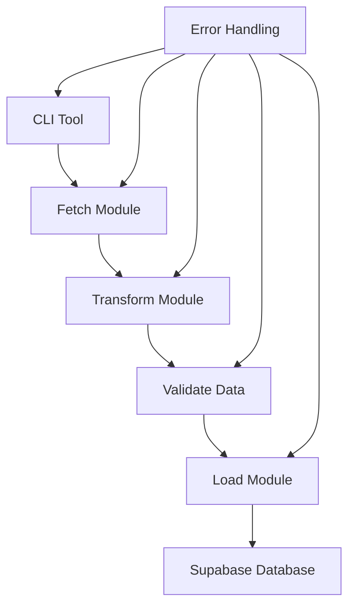
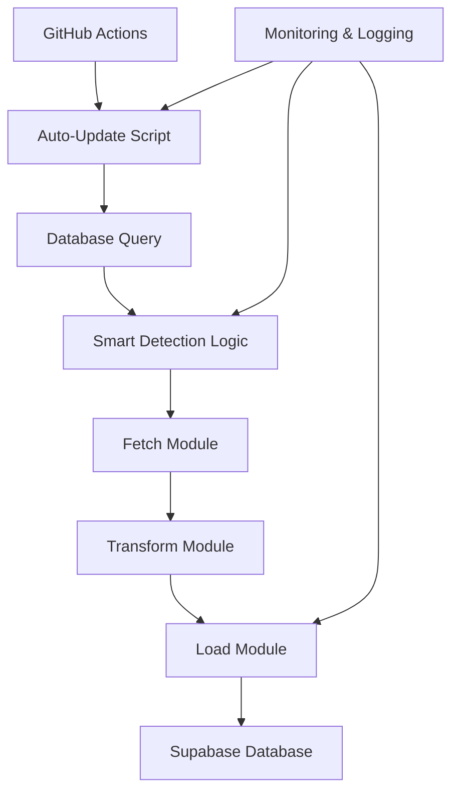

# Technical Details

This document provides detailed technical information about the T4LAPIs system architecture, implementation details, and design decisions.

## 🏗️ System Architecture

### Overall Design Philosophy

The T4LAPIs system follows a **modular, pipeline-based architecture** with clear separation of concerns:

```
Data Flow: NFL API → Fetch → Transform → Validate → Load → Supabase
                    ↓
                CLI Tools ← Auto Scripts ← GitHub Actions
```

### Core Design Principles

1. **Separation of Concerns**: Distinct modules for fetching, transforming, and loading
2. **Error Resilience**: Comprehensive error handling at every layer
3. **Data Integrity**: Validation and conflict resolution mechanisms
4. **Scalability**: Modular design supports easy extension and modification
5. **Maintainability**: Clear code structure, comprehensive tests, and documentation

## 📦 Module Architecture

### 1. Data Management Pipeline (`src/core/data/`)

#### Fetch Module (`fetch.py`)
```python
# Purpose: Raw data retrieval from nfl_data_py
# Pattern: Simple wrapper functions with error handling
# Dependencies: nfl_data_py, pandas, logging

def fetch_team_data() -> pd.DataFrame:
    """Fetch raw team data from NFL API"""
    
def fetch_player_data(years: List[int]) -> pd.DataFrame:
    """Fetch raw player roster data"""
    
def fetch_game_schedule_data(years: List[int]) -> pd.DataFrame:
    """Fetch raw game schedule data"""
    
def fetch_weekly_stats_data(years: List[int]) -> pd.DataFrame:
    """Fetch raw weekly statistics data"""
```

**Design Decisions:**
- **Pure Functions**: No side effects, only data retrieval
- **Standardized Interface**: Consistent function signatures
- **Error Propagation**: Let calling code handle errors appropriately

#### Transform Module (`transform.py`)
```python
# Purpose: Data cleaning, validation, and formatting
# Pattern: Transformer classes with inheritance hierarchy
# Dependencies: pandas, logging

class BaseDataTransformer:
    """Base class for all data transformers"""
    
    def transform(self, df: pd.DataFrame) -> pd.DataFrame:
        """Main transformation pipeline"""
        
    def _validate_input(self, df: pd.DataFrame) -> None:
        """Input validation"""
        
    def _deduplicate_records(self, df: pd.DataFrame) -> pd.DataFrame:
        """Remove duplicates (overrideable)"""

class PlayerDataTransformer(BaseDataTransformer):
    """Specialized transformer for player data"""
    
    def _deduplicate_records(self, df: pd.DataFrame) -> pd.DataFrame:
        """Player-specific deduplication logic"""
```

**Design Decisions:**
- **Template Method Pattern**: Base class defines pipeline, subclasses customize steps
- **Strategy Pattern**: Different transformers for different data types
- **Immutable Operations**: Transformations don't modify input data

#### Loaders Module (`loaders/`)
```python
# Purpose: Database loading with conflict resolution
# Pattern: Loader classes with common interface
# Dependencies: supabase, pandas, logging

class BaseDataLoader:
    """Base class for all data loaders"""
    
    def load(self, df: pd.DataFrame, **options) -> bool:
        """Main loading pipeline"""

class TeamsLoader(BaseDataLoader):
    """Teams data loader with upsert logic"""
    
class PlayersLoader(BaseDataLoader):
    """Players data loader with duplicate handling"""
```

### 2. Database Management (`src/core/db/` & `src/core/utils/`)

#### Database Utilities (`utils/database.py`)
```python
# Purpose: Supabase connection and operations management
# Pattern: Utility functions with connection pooling
# Dependencies: supabase, os, logging

def get_supabase_client():
    """Get configured Supabase client"""
    
def insert_data(table_name: str, records: List[Dict]) -> bool:
    """Insert data with error handling"""
    
def upsert_data(table_name: str, records: List[Dict], 
                on_conflict: str = None) -> bool:
    """Upsert data with conflict resolution"""
```

**Design Decisions:**
- **Connection Management**: Centralized client creation and configuration
- **Error Handling**: Comprehensive error catching and logging
- **Conflict Resolution**: Built-in support for PostgreSQL upsert operations

#### Database Initialization (`db/database_init.py`)
```python
# Purpose: Database schema and table management
# Pattern: Declarative schema definitions
# Dependencies: supabase, logging

def ensure_tables_exist():
    """Create tables if they don't exist"""
    
def get_table_schema(table_name: str) -> Dict:
    """Get table schema definition"""
```

### 3. CLI and Automation (`scripts/`)

#### CLI Tools
```python
# Purpose: Command-line interfaces for manual operations
# Pattern: argparse-based CLI with common options
# Dependencies: argparse, logging, core modules

def main():
    parser = argparse.ArgumentParser()
    parser.add_argument('--dry-run', action='store_true')
    parser.add_argument('--verbose', action='store_true')
    parser.add_argument('--clear', action='store_true')
    # Tool-specific arguments
```

#### Auto-Update Scripts
```python
# Purpose: Intelligent data updating for automation
# Pattern: Smart detection and incremental updates
# Dependencies: core modules, database utils

def get_current_nfl_season() -> int:
    """Detect current NFL season (Sept-Aug cycle)"""
    
def get_latest_week_from_db(season: int) -> int:
    """Find most recent week in database"""
    
def main():
    """Smart update logic with error handling"""
```

## 🔄 Data Flow Architecture

### 1. Manual Data Loading Flow



### 2. Automated Update Flow



## 🗄️ Database Schema Design

### Core Tables

#### Teams Table
```sql
CREATE TABLE teams (
    team_abbr TEXT PRIMARY KEY,              -- "ARI", "NE", etc.
    team_name TEXT NOT NULL,                 -- "Arizona Cardinals"
    team_conference TEXT,                    -- "NFC", "AFC"
    team_division TEXT,                      -- "NFC West"
    team_nfl_data_py_id INTEGER,            -- External API ID
    team_nick TEXT,                          -- "Cardinals"
    team_color TEXT,                         -- Primary color hex
    team_color2 TEXT,                        -- Secondary color hex
    team_color3 TEXT,                        -- Tertiary color hex
    team_color4 TEXT                         -- Quaternary color hex
);
```

#### Players Table
```sql
CREATE TABLE players (
    player_id TEXT PRIMARY KEY,              -- Unique player identifier
    player_name TEXT NOT NULL,               -- "Tom Brady"
    team TEXT,                               -- Current team abbreviation
    position TEXT,                           -- "QB", "RB", etc.
    jersey_number INTEGER,                   -- Jersey number
    height TEXT,                             -- "6-4"
    weight INTEGER,                          -- Weight in pounds
    college TEXT,                            -- College attended
    years_exp INTEGER,                       -- Years of experience
    birth_date DATE,                         -- Birth date
    last_active_season INTEGER,              -- Most recent active season
    -- Foreign key to teams
    CONSTRAINT fk_player_team 
        FOREIGN KEY (team) REFERENCES teams(team_abbr)
);
```

#### Games Table
```sql
CREATE TABLE games (
    game_id TEXT PRIMARY KEY,                -- Unique game identifier
    season INTEGER NOT NULL,                 -- NFL season year
    week INTEGER NOT NULL,                   -- Week number (1-22)
    gameday DATE,                            -- Game date
    gametime TIME,                           -- Game time
    away_team TEXT NOT NULL,                 -- Away team abbreviation
    home_team TEXT NOT NULL,                 -- Home team abbreviation
    away_score INTEGER,                      -- Final away score
    home_score INTEGER,                      -- Final home score
    game_type TEXT,                          -- "REG", "WC", "DIV", etc.
    -- Foreign keys to teams
    CONSTRAINT fk_away_team 
        FOREIGN KEY (away_team) REFERENCES teams(team_abbr),
    CONSTRAINT fk_home_team 
        FOREIGN KEY (home_team) REFERENCES teams(team_abbr)
);
```

#### Player Weekly Stats Table
```sql
CREATE TABLE player_weekly_stats (
    stat_id TEXT PRIMARY KEY,                -- Composite key: player_id_season_week
    player_id TEXT NOT NULL,                 -- Player identifier
    player_name TEXT,                        -- Player name (denormalized)
    recent_team TEXT,                        -- Team during that week
    season INTEGER NOT NULL,                 -- NFL season
    week INTEGER NOT NULL,                   -- Week number
    
    -- Passing stats
    passing_yards INTEGER,
    passing_tds INTEGER,
    interceptions INTEGER,
    
    -- Rushing stats  
    rushing_yards INTEGER,
    rushing_tds INTEGER,
    
    -- Receiving stats
    receiving_yards INTEGER,
    receiving_tds INTEGER,
    receptions INTEGER,
    targets INTEGER,
    
    -- Foreign keys
    CONSTRAINT fk_player_stats 
        FOREIGN KEY (player_id) REFERENCES players(player_id),
    CONSTRAINT fk_team_stats 
        FOREIGN KEY (recent_team) REFERENCES teams(team_abbr)
);
```

### Design Decisions

1. **Composite Keys**: Use meaningful composite keys for statistics
2. **Denormalization**: Store player names in stats for query performance
3. **Foreign Keys**: Maintain referential integrity where appropriate
4. **Nullable Fields**: Allow nulls for optional data (scores before games)

## 🔧 Configuration Management

### Environment Variables

```python
# Required Configuration
SUPABASE_URL = "https://your-project.supabase.co"
SUPABASE_KEY = "your-anon-key-or-service-key"

# Optional Configuration  
LOG_LEVEL = "INFO"  # DEBUG, INFO, WARNING, ERROR
DATABASE_TIMEOUT = "30"  # Connection timeout in seconds
```

### Configuration Loading

```python
# Pattern: Environment-first with defaults
import os
from dotenv import load_dotenv

load_dotenv()  # Load .env file if present

SUPABASE_URL = os.getenv('SUPABASE_URL')
if not SUPABASE_URL:
    raise ValueError("SUPABASE_URL environment variable required")

LOG_LEVEL = os.getenv('LOG_LEVEL', 'INFO')
```

## 🚨 Error Handling Strategy

### Error Categories and Handling

1. **Configuration Errors** (Fatal):
   ```python
   # Missing environment variables, invalid configuration
   # Action: Fail fast with clear error message
   if not SUPABASE_URL:
       raise ValueError("SUPABASE_URL environment variable required")
   ```

2. **Network/API Errors** (Retryable):
   ```python
   # NFL API timeouts, connection issues
   # Action: Retry with exponential backoff
   @retry(max_attempts=3, backoff_factor=2)
   def fetch_data():
       return nfl.import_team_desc()
   ```

3. **Data Validation Errors** (Recoverable):
   ```python
   # Invalid data formats, missing required fields
   # Action: Skip invalid records, log warnings, continue
   try:
       validate_record(record)
   except ValidationError as e:
       logger.warning(f"Skipping invalid record: {e}")
       continue
   ```

4. **Database Errors** (Context-dependent):
   ```python
   # Connection failures, constraint violations
   # Action: Depends on context (retry, skip, fail)
   try:
       insert_data(records)
   except DatabaseError as e:
       if "connection" in str(e).lower():
           # Retry connection errors
           retry_insert(records)
       else:
           # Log and re-raise constraint violations
           logger.error(f"Database constraint error: {e}")
           raise
   ```

### Logging Strategy

```python
import logging

# Configure logging levels
logging.basicConfig(
    level=getattr(logging, LOG_LEVEL.upper()),
    format='%(asctime)s - %(name)s - %(levelname)s - %(message)s'
)

logger = logging.getLogger(__name__)

# Usage patterns
logger.info("Starting data fetch...")          # Normal operations
logger.warning("Skipping invalid record")      # Recoverable issues  
logger.error("Database connection failed")     # Serious problems
logger.debug("Processing record: %s", record)  # Detailed debugging
```

## ⚡ Performance Considerations

### Data Processing Optimization

1. **Batch Processing**: Process data in chunks to manage memory
   ```python
   chunk_size = 1000
   for chunk in pd.read_csv(file, chunksize=chunk_size):
       process_chunk(chunk)
   ```

2. **Pandas Optimization**: Use efficient data types and operations
   ```python
   # Use categorical for repeated strings
   df['team'] = df['team'].astype('category')
   
   # Vectorized operations over loops
   df['stat_id'] = df['player_id'] + '_' + df['season'].astype(str)
   ```

3. **Database Optimization**: Batch inserts and upserts
   ```python
   # Batch database operations
   batch_size = 500
   for i in range(0, len(records), batch_size):
       batch = records[i:i + batch_size]
       upsert_data(table_name, batch)
   ```

### Memory Management

```python
# Clear large DataFrames when done
del large_dataframe
gc.collect()

# Use generators for large datasets
def process_large_dataset():
    for chunk in get_data_chunks():
        yield process_chunk(chunk)
```

## 🔐 Security Considerations

### API Key Management

1. **Environment Variables**: Never hardcode credentials
2. **Service Keys**: Use appropriate Supabase key types
3. **Minimal Permissions**: Grant only necessary database permissions

### Database Security

```python
# Use parameterized queries (handled by Supabase client)
# Validate input data
# Use appropriate error handling to avoid information leakage
```

## 🧪 Testing Architecture

### Test Strategy

1. **Unit Tests**: Test individual functions in isolation
2. **Integration Tests**: Test component interactions
3. **End-to-End Tests**: Test complete workflows
4. **Mock External Dependencies**: Isolate tests from external services

### Test Organization

```python
# Test structure mirrors source structure
tests/
├── test_fetch.py           # src/core/data/fetch.py
├── test_transform.py       # src/core/data/transform.py
├── test_loaders.py         # src/core/data/loaders/
└── test_database.py        # src/core/utils/database.py
```

## 🔄 Data Consistency & Integrity

### Duplicate Handling

```python
# Player data deduplication strategy
def _deduplicate_records(self, df: pd.DataFrame) -> pd.DataFrame:
    # Keep most recent record per player_id
    return df.sort_values('last_active_season').drop_duplicates(
        subset=['player_id'], keep='last'
    )
```

### Conflict Resolution

```python
# Database upsert strategy
def upsert_data(table_name: str, records: List[Dict], 
                on_conflict: str = None) -> bool:
    # PostgreSQL ON CONFLICT DO UPDATE
    supabase.table(table_name).upsert(
        json=records, 
        on_conflict=on_conflict
    )
```

## 🚀 Deployment Architecture

### Docker Configuration

```dockerfile
# Multi-stage build for efficiency
FROM python:3.9-slim as base
WORKDIR /app
COPY requirements.txt .
RUN pip install -r requirements.txt

FROM base as runtime
COPY src/ ./src/
COPY scripts/ ./scripts/
CMD ["python", "-m", "src.core.main"]
```

### GitHub Actions Integration

```yaml
# Workflow configuration
name: NFL Data Update
on:
  schedule:
    - cron: '0 5 * * 1,2,4,5,6,7'  # 6 days/week
jobs:
  update-data:
    runs-on: ubuntu-latest
    steps:
      - uses: actions/checkout@v2
      - name: Run update script
        env:
          SUPABASE_URL: ${{ secrets.SUPABASE_URL }}
          SUPABASE_KEY: ${{ secrets.SUPABASE_KEY }}
        run: python scripts/games_auto_update.py
```

## 📈 Monitoring & Observability

### Logging Integration

- **Structured Logging**: JSON format for easy parsing
- **Context Information**: Include relevant IDs and timestamps
- **Error Tracking**: Comprehensive error logging with stack traces

### Metrics Collection

- **Processing Times**: Track execution duration
- **Record Counts**: Monitor data volume processed
- **Error Rates**: Track failure percentages
- **Database Performance**: Monitor query execution times

For more specific implementation details, see:
- [NFL Data Reference](NFL_Data_Reference.md) - Data structure details
- [Testing Guide](Testing_Guide.md) - Testing implementation
- [CLI Tools Guide](CLI_Tools_Guide.md) - CLI implementation details
